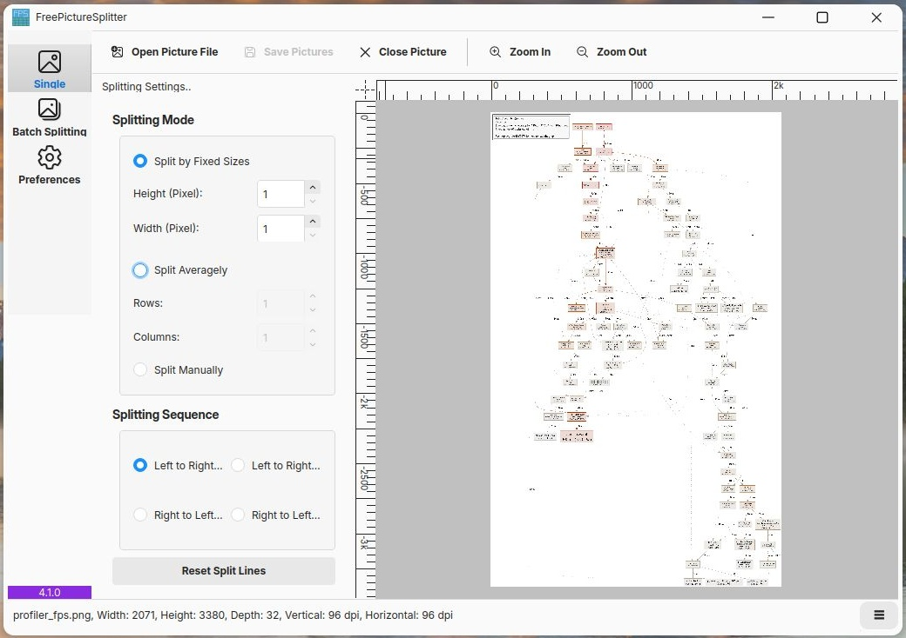

<h1>FreePictureSplitter</h1>

Español | [简体中文](docs/zh/index.md)

## Descargas

**Recomendado**: El último paquete compilado de FreePictureSplitter puede descargarse desde [GitHub Actions](https://github.com/zxunge/FreePictureSplitter/actions/workflows/packages.yml).
La última versión está disponible en [GitHub Releases](https://github.com/zxunge/FreePictureSplitter/releases).

# Introducción

Potencia tu edición de fotos dividiéndolas de la mejor manera :zap:

> [!IMPORTANTE]
> Como hemos movido algunos archivos fuera del historial de este repositorio,
> por favor vuelve a clonar este repositorio si lo clonaste antes del 8 de julio de 2025.

## Captura de pantalla del proyecto

> [!Nota]
> Cuando introduzcamos nuevas funciones en FreePictureSplitter en el futuro, nos referiremos a la versión 3 o superior de FPS.

## Objetivos

FreePictureSplitter tiene los siguientes objetivos:
Objetivos | Implementación
------|------
División por lotes | ✅
Múltiples formatos de imagen | ✅
División uniforme | ✅
División de una sola imagen | ✅
División por tamaños | ✅
Figuras en cuadrícula | ✅
Configuraciones de usuario | ✅
Generación de HTML | ❎
Control de calidad | ✅

## [Uso](docs/en/usage.md)
### 1. Modo de imagen única: Control total sobre cada corte

#### Abrir una imagen
- Haz clic en el botón **Abrir archivo de imagen** en la barra de herramientas (o presiona `Ctrl+O`) y selecciona una imagen.
- La imagen aparecerá en el área de vista previa de la derecha, y los botones de cierre y zoom se activarán.

#### Dibujar líneas de división manualmente
- Haz clic y mantén presionado en la **régua superior** o **régua izquierda** del área de vista previa: el cursor se convertirá en una cruz.
- Arrastra el cursor hacia cualquier posición dentro de la imagen y suelta el ratón para crear una línea de división (vertical u horizontal).
- Repite el proceso para agregar varias líneas y crear divisiones rectangulares arbitrarias. El panel derecho cambiará automáticamente al modo **"Dividir manualmente"**.

#### Usar parámetros de división automática
Si necesitas un corte rápido y uniforme, utiliza el panel **"Modo de división"** en la derecha:
- **Dividir por tamaños fijos**: Introduce una altura/ancho fijo para los bloques (en píxeles); la imagen se dividirá en bloques de igual tamaño.
- **Dividir uniformemente**: Introduce el número deseado de filas y columnas; el programa calculará automáticamente los tamaños de los bloques.
Debes hacer clic en **Restablecer líneas de división** para aplicar los cambios en los parámetros.

> 💡 El modo manual y el modo de parámetros son mutuamente exclusivos. Al hacer clic en **Restablecer líneas de división**, se eliminarán todas las líneas de división manuales existentes, aunque se permiten pequeños ajustes.

#### Guardar el resultado
- Haz clic en **Guardar imágenes** (`Ctrl+S`). El programa guardará cada pieza como un archivo de imagen separado, según el método y la secuencia de división elegidos.
- La carpeta de destino y las reglas de nombramiento de archivos pueden preconfigurarse en **Preferencias**.

---

### 2. Modo por lotes: Procesa cientos de imágenes de una sola vez

#### Agregar imágenes
- Haz clic en **Agregar imágenes** (`Ctrl+A`) para seleccionar uno o más archivos de imagen.
- O haz clic en **Agregar directorio** (`Ctrl+D`) para agregar una carpeta completa (incluidos todos los archivos de imagen en subcarpetas, si es necesario).
- Las imágenes agregadas se muestran en la vista central. Utiliza los dos botones de la barra de herramientas para cambiar entre vistas:
  - **Mostrar miniaturas**: Vista de iconos para una rápida visualización.
  - **Mostrar información detallada**: Vista de tabla que muestra el nombre del archivo, las dimensiones, el tamaño, etc.

#### Configurar parámetros de división
El panel izquierdo (**Configuración de división...**) ofrece tres métodos de división:
- **Dividir uniformemente**: Especifica un número uniforme de **filas** y **columnas**; cada imagen se cortará utilizando esta cuadrícula.
- **Dividir por tamaños fijos**: Especifica una **altura** y **anchura** fijas (en píxeles); cada imagen se divide en bloques de igual tamaño.
- **Dividir usando plantillas**: (Reservado para uso futuro, actualmente desactivado)

También puedes elegir la **secuencia de división** (por ejemplo, de izquierda a derecha, de derecha a izquierda, etc.), lo que afecta el orden de las piezas resultantes.

#### Elegir la ubicación de salida
En el panel inferior **Ubicación de salida**:
- Selecciona **"La misma ubicación que cada imagen fuente"** para que las divisiones de cada imagen se guarden en su carpeta original.
- Selecciona **"La siguiente ruta"**, luego haz clic en **Cambiar...** para especificar un directorio de salida común. Si marcas **Crear subdirectorios**, el programa creará subcarpetas con el nombre de las imágenes originales dentro de ese directorio.

#### Iniciar el proceso por lotes
- Haz clic en el botón **Iniciar división...**; aparecerá un diálogo de progreso.
- La barra de progreso muestra el progreso general, y el número de archivos restantes se muestra debajo. Puedes hacer clic en **Cancelar** en cualquier momento para abortar.
- Si ocurren errores (por ejemplo, archivos corruptos, problemas de permisos), el **Diálogo de registro de errores** aparecerá después de que finalice el proceso, enumerando los archivos fallidos y las razones. Puedes **Guardar todo** para exportar el registro o simplemente cerrarlo.

#### Otras operaciones
- Selecciona una o más imágenes en la lista y utiliza **Eliminar de la lista** (`Ctrl+R`) para eliminarlas solo de la lista, o **Eliminar del disco** (`Ctrl+Del`) para eliminarlas permanentemente de tu unidad (usa con precaución).

---

### 3. Preferencias: Personaliza tu experiencia

Abre **PreferencesWidget** desde el menú principal. El lado izquierdo muestra las categorías; el lado derecho muestra las opciones detalladas.

#### Apariencia
- **Idioma**: Selecciona el idioma de la interfaz de usuario.
- **Skin de la aplicación**: Cambia el skin del programa. El botón **+** permite importar hojas de estilo personalizadas.

#### Salida
Estas configuraciones afectan a todas las tareas de división por lotes:

- **Guardar en**: Elige la estrategia de ubicación de salida (igual que en el panel de lotes) y, opcionalmente, especifica una ruta fija.
- **Formato de salida de imagen**: Selecciona el formato (por ejemplo, JPG, PNG).
- **Calidad JPG**: Solo para JPG; valores más altos dan mejor calidad (0–100).
- **Escalado de imagen**: Escala las imágenes de salida por porcentaje (predeterminado 100% = sin escalado).
- **Generar automáticamente una figura de cuadrícula**: Cuando está marcado, se genera una **ilustración de cuadrícula** para cada imagen original, mostrando las áreas de división con líneas coloreadas. Debajo puedes configurar:
  - **Tamaño de línea**: Grosor de las líneas de la cuadrícula (en píxeles).
  - **Color de línea de cuadrícula**: Haz clic en el parche de color o en el botón **Seleccionar color...** para elegir el color de la línea.

- **Convenciones de nombres de archivo**:
  - **Usar el nombre de archivo original como prefijo**: Los archivos de salida se nombran como `original_fila_columna.ext`.
  - **Usar el prefijo especificado**: Usa un prefijo personalizado, por ejemplo, `splited_fila_columna.ext`.
  - **[Número de fila * Número de columna] contenido en el nombre de los archivos**: Si está marcado, el número de fila x columna se incluye en el nombre del archivo (por ejemplo, `original_2x3_1.jpg`).

---

### 4. Consejos y trucos

- **Vista previa de zoom**: En el modo de imagen única, utiliza **Zoom In** (`Ctrl+Alt+I`) y **Zoom Out** (`Ctrl+Alt+O`) para magnific o reducir la imagen, lo que facilita la colocación precisa de las líneas de división.
- **Cerrar imagen**: Después de procesar una imagen, haz clic en **Cerrar imagen** para liberar memoria y volver a un estado en blanco.
- **Registro de errores**: Si el registro de errores aparece después del procesamiento por lotes, puedes seleccionar múltiples filas y presionar `Ctrl+C` para copiar los detalles y solucionar problemas.
- **Uso de la figura de cuadrícula**: La ilustración de cuadrícula generada automáticamente es especialmente útil cuando necesitas compartir tu diseño de división con otros o mantener un "plan de corte" de referencia.

## Requisitos

Es importante saber que nuestras versiones **3.x** admiten Qt >= 5.15, mientras que la próxima versión 4 solo admitirá Qt >= 6.9.0. Por lo tanto, algunos usuarios con computadoras antiguas pueden necesitar soluciones alternativas, como una capa de compatibilidad.

## Créditos

Este proyecto incluye iconos del proyecto [Fluent UI System Icons](https://github.com/microsoft/fluentui-system-icons), con derechos de autor de Microsoft Corporation y utilizados bajo la Licencia MIT. Consulta el archivo NOTICES para ver el texto completo de la licencia.

## Construcción

Consulta [Construcción](docs/en/build.md)

## Historial de estrellas

