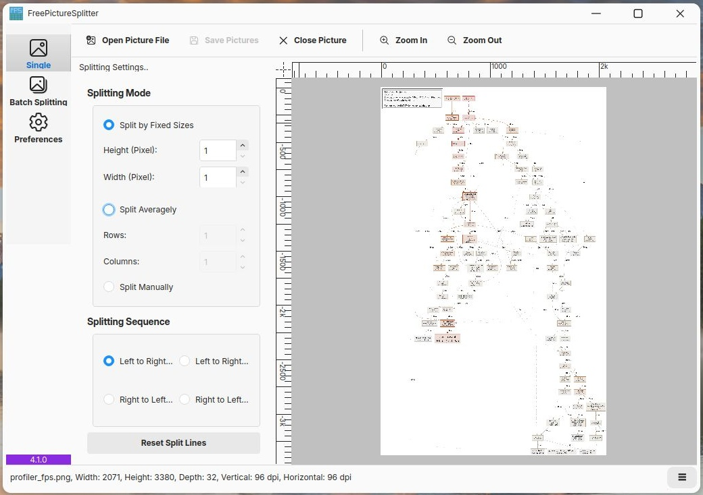

<h1>FreePictureSplitter</h1>

English | [简体中文](docs/zh/index.md)

# Introduction

Empower your photo processing by splitting to its best :zap:

> [!IMPORTANT]  
> As we have moved some files out of this repo's history,
> please re-clone this repository if you have previously cloned it before 2025/07/08.

## Project Screenshot

> [!Note]
> When we introduce something of FreePictureSplitter later, we refer to FPS version 3 and higher.

## Goals

FreePictureSplitter has the following goals:
Goals | Implementation
------|------
Batch splitting | ✅
Multiple picture formats | ✅
Splitting averagely | ✅
Single picture splitting | ✅
Splitting by sizes | ✅
Grid Figures | ✅
User configurations | ✅
HTML generation | ❎
Quality control | ✅

## Releases

**Recommended**: The latest built package for FreePictureSplitter can be downloaded from [GitHub Actions](https://github.com/zxunge/FreePictureSplitter/actions/workflows/packages.yml).
The latest release can be found at [Github Releases](https://github.com/zxunge/FreePictureSplitter/releases).

## Requirements

It's important to know that our **3.x** versions support Qt >= 5.15, while the incoming version 4 will only support Qt >= 6.9.0. Thus, some users with old computers would need some workaround like a compatibility-layer.

## Credits

This project includes icons from the [Fluent UI System Icons](https://github.com/microsoft/fluentui-system-icons) project, copyright Microsoft Corporation and used under the MIT License. See the NOTICES file for full license text.

## Building

See [Building](docs/en/build.md)

## Star History

## SAST Tools

[PVS-Studio](https://pvs-studio.com/en/pvs-studio/?utm_source=website&utm_medium=github&utm_campaign=open_source) - static analyzer for C, C++, C#, and Java code.
