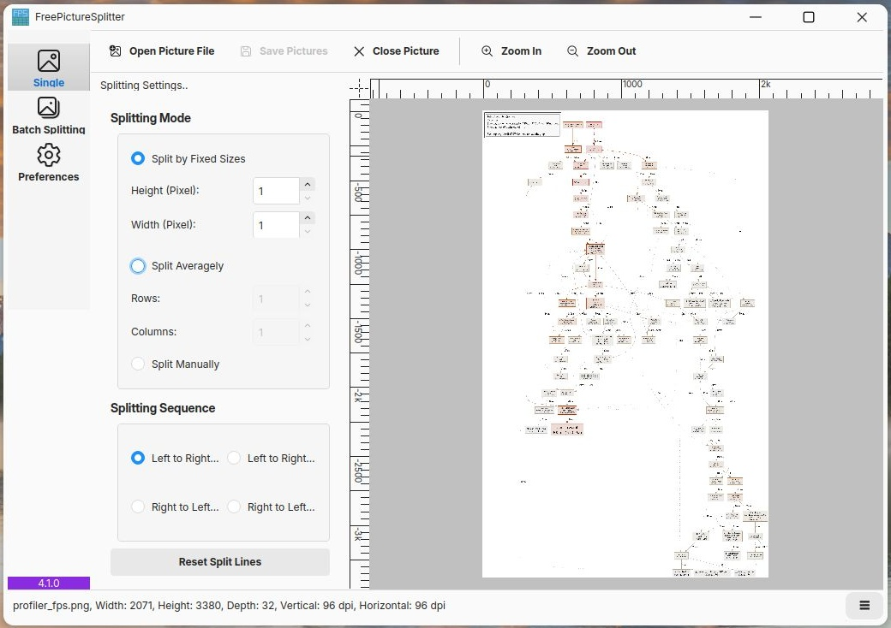

<h1>FreePictureSplitter</h1>

English | [简体中文](docs/zh/index.md)

# Introduction

Empower your photo processing by splitting to its best :zap:

> [!IMPORTANT]  
> As we have moved some files out of this repo's history,
> please re-clone this repository if you have previously cloned it before 2025/07/08.

## Project Screenshot

> [!Note]
> When we introduce something of FreePictureSplitter later, we refer to FPS version 3 and higher.

## Goals

FreePictureSplitter has the following goals:
Goals | Implementation
------|------
Batch splitting | ✅
Multiple picture formats | ✅
Splitting averagely | ✅
Single picture splitting | ✅
Splitting by sizes | ✅
Grid Figures | ✅
User configurations | ✅
HTML generation | ❎
Quality control | ✅

## [Usage](docs/en/usage.md)
### 1. Single Image Mode – Full Control Over Every Cut

#### Opening an Image
- Click the **Open Picture File** button on the toolbar (or press `Ctrl+O`) and select an image.
- The image will appear in the preview area on the right, and the close/zoom buttons will become enabled.

#### Drawing Split Lines Manually
- Click and hold on the **top ruler** or **left ruler** of the preview area – the cursor will turn into a crosshair.
- Drag into the image to any position and release the mouse to create a split line (vertical or horizontal).
- Repeat to add multiple lines, allowing arbitrary rectangular divisions. The right panel will automatically switch to **“Split Manually”** mode.

#### Using Automatic Splitting Parameters
If you need fast uniform cutting, use the **“Splitting Mode”** panel on the right:
- **Split by Fixed Sizes**: Enter a fixed tile height/width (in pixels); the image will be divided into equal‑sized blocks.
- **Split Averagely**: Enter the desired number of rows and columns; the program will calculate the block sizes automatically.
You will need to click **Reset Split Lines** to apply the parameter changes.

> 💡 Manual mode and parameter mode are mutually exclusive. Clicking **Reset Split Lines** will clear any existing manual split lines. But slight adjustments are allowed.

#### Saving the Result
- Click **Save Pictures** (`Ctrl+S`). The program will save each piece as a separate image file according to your chosen splitting method and sequence.
- The destination folder and file naming rules can be preset in **Preferences**.

---

### 2. Batch Mode – Process Hundreds of Images at Once

#### Adding Images
- Click **Add pictures** (`Ctrl+A`) to select one or more image files.
- Or click **Add directory** (`Ctrl+D`) to add an entire folder (including all images in subdirectories if needed).
- Added images are displayed in the central view. Use the two toolbar buttons to switch views:
  - **Show thumbnails**: Icon view for quick previews.
  - **Show detailed info**: Table view showing file name, dimensions, size, etc.

#### Setting Split Parameters
The left dock panel (**Splitting Settings..**) offers three splitting methods:
- **Split Averagely**: Specify uniform **rows** and **columns**; every image will be cut using this grid.
- **Split by fixed sizes**: Specify fixed **height** and **width** (in pixels); each image is divided into equal blocks of that size.
- **Split using templates**: (Reserved for future use, currently disabled)

You can also choose the **splitting sequence** (e.g., left‑to‑right, right‑to‑left, etc.), which affects how the resulting pieces are ordered.

#### Choosing the Output Location
In the bottom panel **Output Location**:
- Select **“The same location as each source picture”** – each image’s splits are saved in its original folder.
- Select **“The following path”**, then click **Change…** to specify a common output directory. If you check **Create Sub-directories**, the program will create subfolders named after the original images inside that directory.

#### Starting the Batch Process
- Click the **Start Splitting…** button; a progress dialog will appear.
- The progress bar shows overall progress, and the remaining file count is displayed below. Click **Cancel** at any time to abort.
- If any errors occur (e.g., corrupted files, permission issues), the **Error Log Dialog** will pop up after the process finishes, listing the failed files and reasons. You can **Save All** to export the log or simply close it.

#### Other Operations
- Select one or more images in the list, then use **Remove from list** (`Ctrl+R`) to remove them only from the list, or **Remove from disk** (`Ctrl+Del`) to permanently delete them from your drive (use with caution!).

---

### 3. Preferences – Customise Your Experience

Open **PreferencesWidget** from the main menu. The left side lists categories; the right side shows detailed options.

#### Appearance
- **Language**: Choose the UI language.
- **App Skin**: Switch the program skin. The **+** button lets you import custom stylesheets.

#### Output
These settings affect all batch splitting tasks:

- **Saving to**: Choose the output location strategy (same as in the batch panel) and optionally specify a fixed path.
- **Output picture format**: Select the format (e.g., JPG, PNG).
- **JPG Quality**: Only for JPG – higher values give better quality (0–100).
- **Picture scaling**: Scale the output images by percentage (default 100% = no scaling).
- **Auto-generate a grid figure**: When checked, for each original image a **grid illustration** is generated, showing the split areas with coloured lines. Below you can set:
  - **Line size**: Thickness of the grid lines (in pixels).
  - **Grid line color**: Click the colour patch or the **Select Color…** button to choose the line colour.

- **File Name Conventions**:
  - **Use the original file name as the prefix**: Output files are named as `original_row_column.ext`.
  - **Use the specified prefix**: Use a custom prefix, e.g., `splited_row_column.ext`.
  - **[Row number * Column number] contained in files' name**: If checked, the Row number x Column number is included in the file name (e.g., `original_2x3_1.jpg`).

---

### 4. Tips & Tricks

- **Zoom Preview**: In single image mode, use **Zoom In** (`Ctrl+Alt+I`) and **Zoom Out** (`Ctrl+Alt+O`) to magnify or shrink the image, making it easier to place split lines precisely.
- **Close Picture**: After processing one image, click **Close Picture** to free memory and return to a blank state.
- **Error Log**: If the error log appears after batch processing, you can select multiple rows and press `Ctrl+C` to copy the details for troubleshooting.
- **Grid Figure Use**: The automatically generated grid illustration is especially useful when you need to share your splitting layout with others or keep a “cutting blueprint” for reference.

## Releases

**Recommended**: The latest built package for FreePictureSplitter can be downloaded from [GitHub Actions](https://github.com/zxunge/FreePictureSplitter/actions/workflows/packages.yml).
The latest release can be found at [Github Releases](https://github.com/zxunge/FreePictureSplitter/releases).

## Requirements

It's important to know that our **3.x** versions support Qt >= 5.15, while the incoming version 4 will only support Qt >= 6.9.0. Thus, some users with old computers would need some workaround like a compatibility-layer.

## Credits

This project includes icons from the [Fluent UI System Icons](https://github.com/microsoft/fluentui-system-icons) project, copyright Microsoft Corporation and used under the MIT License. See the NOTICES file for full license text.

## Building

See [Building](docs/en/build.md)

## Star History

## SAST Tools

[PVS-Studio](https://pvs-studio.com/en/pvs-studio/?utm_source=website&utm_medium=github&utm_campaign=open_source) - static analyzer for C, C++, C#, and Java code.
